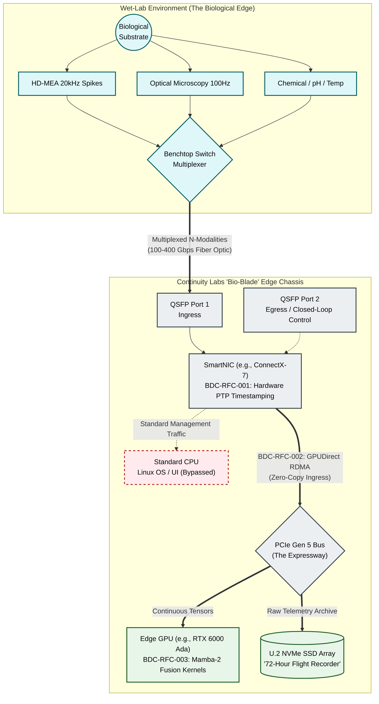

```mermaid
graph TB
    %% Define Styles
    classDef wetlab fill:#e0f7fa,stroke:#006064,stroke-width:2px,color:#000;
    classDef hardware fill:#eceff1,stroke:#37474f,stroke-width:2px,color:#000;
    classDef compute fill:#e8f5e9,stroke:#1b5e20,stroke-width:2px,color:#000;
    classDef bypass fill:#ffebee,stroke:#b71c1c,stroke-width:2px,stroke-dasharray: 5 5,color:#000;

    %% Wet Lab Environment
    subgraph WET_LAB ["Wet-Lab Environment (The Biological Edge)"]
        direction TB
        Bio((Biological<br/>Substrate)):::wetlab --> MEA[HD-MEA 20kHz Spikes]:::wetlab
        Bio --> Opt[Optical Microscopy 100Hz]:::wetlab
        Bio --> Aux[Chemical / pH / Temp]:::wetlab
        
        MEA --> DAQ{Benchtop Switch<br/>Multiplexer}:::wetlab
        Opt --> DAQ
        Aux --> DAQ
    end

    %% The Fiber Connection
    DAQ == "Multiplexed N-Modalities<br/>(100-400 Gbps Fiber Optic)" ===> Port1

    %% The Bio-Blade Chassis
    subgraph BIO_BLADE ["Continuity Labs 'Bio-Blade' Edge Chassis"]
        direction TB
        
        Port1[QSFP Port 1<br/>Ingress]:::hardware --> NIC
        Port2[QSFP Port 2<br/>Egress / Closed-Loop Control]:::hardware -.-> NIC
        
        NIC["SmartNIC (e.g., ConnectX-7)<br/>BDC-RFC-001: Hardware PTP Timestamping"]:::hardware
        
        PCIE{"PCIe Gen 5 Bus<br/>(The Expressway)"}:::hardware
        
        %% Zero-Copy Bypass
        NIC == "BDC-RFC-002: GPUDirect RDMA<br/>(Zero-Copy Ingress)" ===> PCIE
        
        %% Bypassed OS
        CPU["Standard CPU<br/>Linux OS / UI (Bypassed)"]:::bypass
        NIC -. "Standard Management Traffic" .-> CPU
        
        GPU["Edge GPU (e.g., RTX 6000 Ada)<br/>BDC-RFC-003: Mamba-2 Fusion Kernels"]:::compute
        SSD[("U.2 NVMe SSD Array<br/>'72-Hour Flight Recorder'")]:::compute
        
        PCIE ==>|Continuous Tensors| GPU
        PCIE ==>|Raw Telemetry Archive| SSD
    end
```
