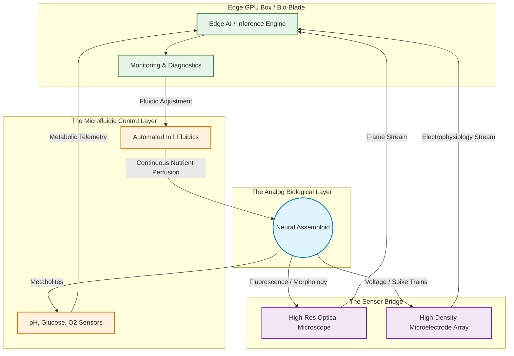

```mermaid
graph TD
    %% Styling
    classDef biological fill:#e1f5fe,stroke:#0277bd,stroke-width:2px;
    classDef hardware fill:#fff3e0,stroke:#ef6c00,stroke-width:2px;
    classDef compute fill:#e8f5e9,stroke:#2e7d32,stroke-width:2px;
    classDef interface fill:#f3e5f5,stroke:#7b1fa2,stroke-width:2px;

    %% Layers
    subgraph The Digital Compute Layer [Edge GPU Box / Bio-Blade]
        GPU[Edge AI / Inference Engine]:::compute
        Policy[Monitoring & Diagnostics]:::compute
        GPU --> Policy
    end

    subgraph The Microfluidic Control Layer
        Autoculture[Automated IoT Fluidics]:::hardware
        Sensors[pH, Glucose, O2 Sensors]:::hardware
    end

    subgraph The Analog Biological Layer
        Substrate((Neural Assembloid)):::biological
    end

    subgraph The Sensor Bridge
        Microscope[High-Res Optical Microscope]:::interface
        MEA[High-Density Microelectrode Array]:::interface
    end

    %% Connections
    Policy -->|Fluidic Adjustment| Autoculture
    Autoculture -->|Continuous Nutrient Perfusion| Substrate
    Substrate -->|Metabolites| Sensors
    Sensors -->|Metabolic Telemetry| GPU

    Substrate -->|Fluorescence / Morphology| Microscope
    Substrate -->|Voltage / Spike Trains| MEA

    Microscope -->|Frame Stream| GPU
    MEA -->|Electrophysiology Stream| GPU
```
