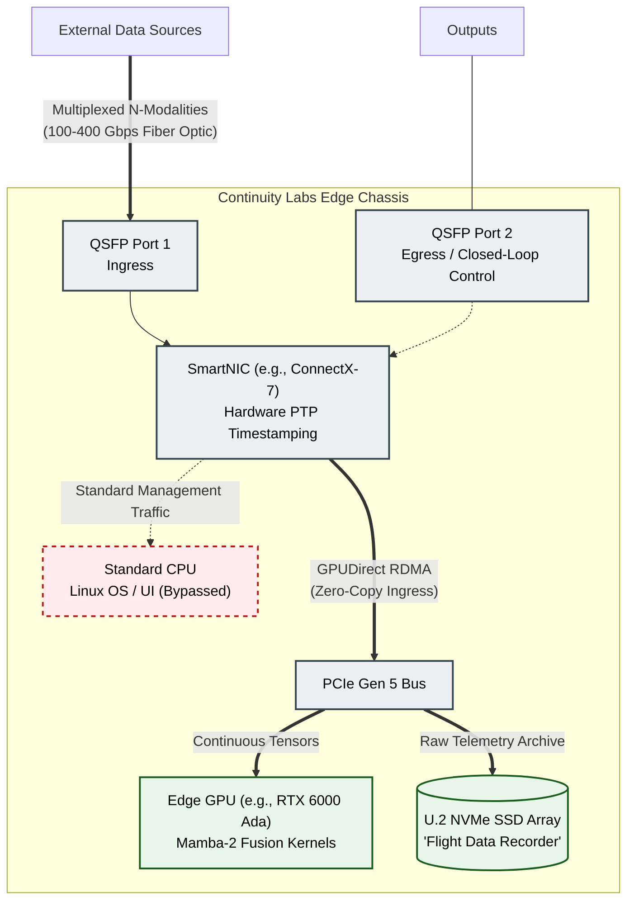

```mermaid
graph TB
    %% Define Styles
    classDef hardware fill:#eceff1,stroke:#37474f,stroke-width:2px,color:#000;
    classDef compute fill:#e8f5e9,stroke:#1b5e20,stroke-width:2px,color:#000;
    classDef bypass fill:#ffebee,stroke:#b71c1c,stroke-width:2px,stroke-dasharray: 5 5,color:#000;


    %% The Fiber Connection
    ExternalData[External Data Sources] == "Multiplexed N-Modalities<br/>(100-400 Gbps Fiber Optic)" ===> Port1

    Output[Outputs] <--- Port2

    %% The Bio-Blade Chassis
    subgraph EDGE_CHASSIS ["Continuity Labs Edge Chassis"]
        direction TB

        Port1[QSFP Port 1<br/>Ingress]:::hardware --> NIC
        Port2[QSFP Port 2<br/>Egress / Closed-Loop Control]:::hardware -.-> NIC

        NIC["SmartNIC (e.g., ConnectX-7)<br/>Hardware PTP Timestamping"]:::hardware

        PCIE["PCIe Gen 5 Bus<br/>"]:::hardware

        %% Zero-Copy Bypass
        NIC == "GPUDirect RDMA<br/>(Zero-Copy Ingress)" ===> PCIE

        %% Bypassed OS
        CPU["Standard CPU<br/>Linux OS / UI (Bypassed)"]:::bypass
        NIC -. "Standard Management Traffic" .-> CPU

        GPU["Edge GPU (e.g., RTX 6000 Ada)<br/>Mamba-2 Fusion Kernels"]:::compute
        SSD[("U.2 NVMe SSD Array<br/>'Flight Data Recorder'")]:::compute

        PCIE ==>|Continuous Tensors| GPU
        PCIE ==>|Raw Telemetry Archive| SSD
    end
```
