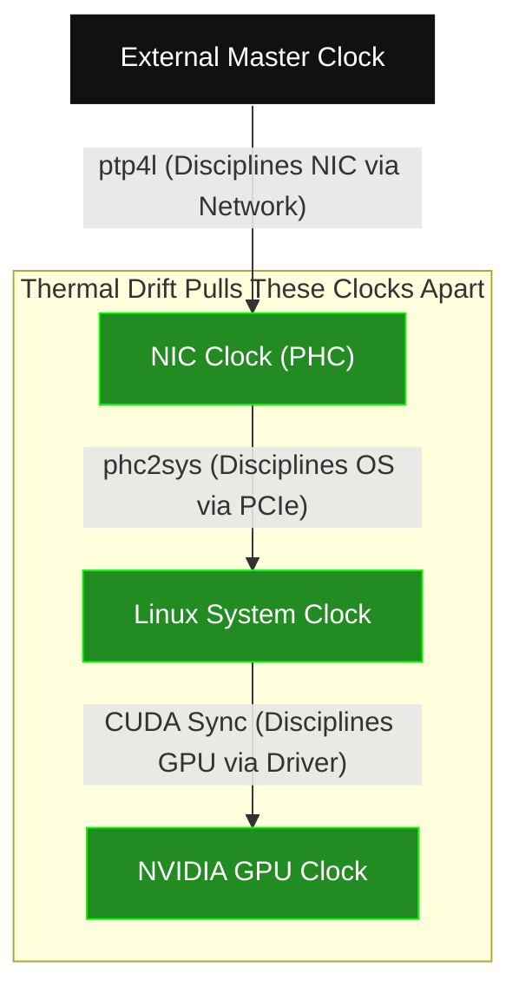
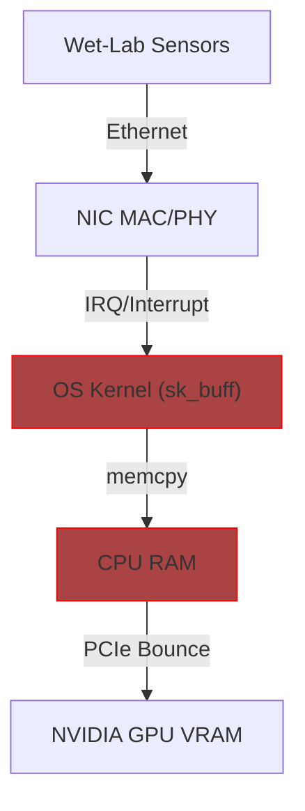
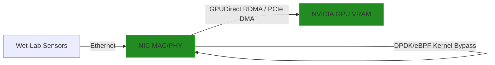
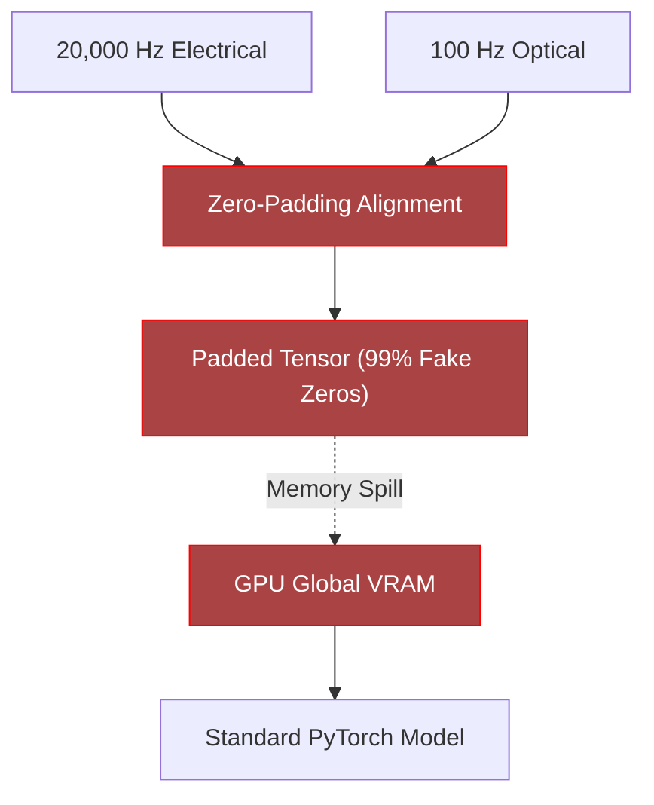
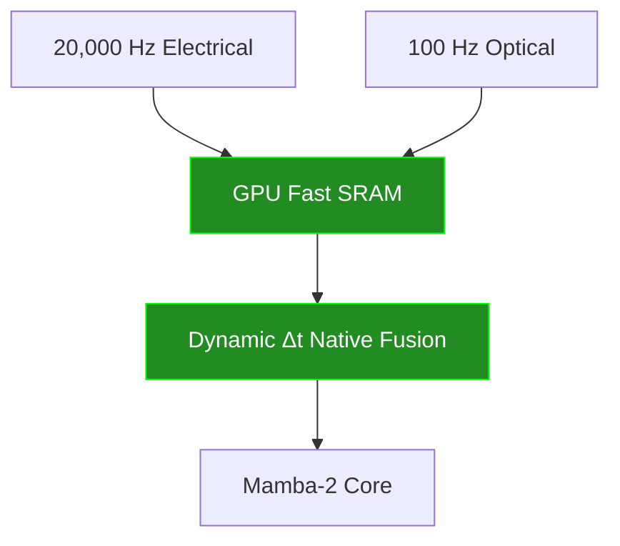

# 🐉 HERE BE DRAGONS: The Bio-Blade Ingress Bottleneck

If you are a systems engineer looking at this directory, the jitter simulator
(`01_jitter_simulator.py`) and the C socket example (`02_hardware_timestamp.c`)
are the extent of the "commodity software" realm. What lies beyond this point is
pure silicon and bare-metal networking. We need you.

## The Core Problem

To successfully model continuous biological dynamics (e.g., Waddington crashes,
epileptic phase transitions) using continuous-time AI (Mamba-2), we must ingest
asynchronous, multi-rate telemetry directly from wet-lab sensors.

**The physical setup:**

- **Sensor A (Optics):** 100 Hz video stream (Phase Contrast / Fluorescent).
- **Sensor B (Electrophysiology):** 20,000 Hz continuous voltage array (HD-MEA).

If we ingest this via standard Linux network stacks, the OS scheduler introduces
millisecond-level jitter. In biological time, a millisecond is an eternity; it
destroys the causal temporal derivative ($dx/dt$). We will not know if the
electrical spark caused the cell to swell, or if the swelling caused the spark.

We must bypass software time entirely.

## What We Have Built

We have written the C socket code to utilize `setsockopt` with the
`SO_TIMESTAMPING` flag, specifically targeting `SOF_TIMESTAMPING_RX_HARDWARE`.
We are successfully pulling the raw MAC-layer hardware timestamps directly off
the Network Interface Card (NIC) silicon. The packet timing is now pristine.

## Where We Want Help

If you understand `ptp4l`, PCIe DMA, eBPF, or GPU memory spaces, this is where
we are bottlenecked. This is a founding engineer challenge.

### Dragon 1: Hardware Clock Discipline (`ptp4l` / `phc2sys`)

**The Problem:** We have the raw hardware timestamps, but the PTP Hardware Clock
(PHC) on the NIC is running at a different speed than the Linux System Clock,
which is running at a different speed than the NVIDIA GPU's internal clock.
Thermal drift from the wet-lab constantly pulls them apart.

**How to Tackle It:** Configure the `ptp4l` and `phc2sys` daemons to act as a
hyper-aggressive PI controller, physically disciplining the clocks to each other
under extreme I/O load without introducing jitter. You must find a pathway to
map the disciplined CPU/NIC time domain into the CUDA execution stream so the
Mamba-2 tensors are stamped with absolute, uncorrupted biological time.

**Tech Stack Required:**

- Linux Networking (`ethtool`, `tcpdump`)
- PTP / IEEE 1588 daemon configuration
- Kernel log (`dmesg`) debugging

### Dragon 2: Zero-Copy Multimodal Ingress (Kernel Bypass)

**The Problem:** Our C sockets are currently reading the timestamped packets
into CPU RAM. Moving 20,000 Hz continuous biological telemetry from CPU RAM to
GPU VRAM for the Mamba-2 engine bottlenecks the PCIe bus. The CPU overheats
("The CPU Bounce"), the OS drops packets, and the continuous Mamba-2 tensor
sequence shatters.

**How to Tackle It:** We must bypass the Linux kernel completely. We need the
incoming biological packets to be written _directly_ from the NIC into the GPU's
memory space, creating an unbroken pipeline from the living tissue to the AI's
latent space. This means intercepting raw UDP payloads before the OS network
stack allocates `sk_buff` memory.

**1. The Commodity Stack** (The Jitter Bottleneck)

 

**2. The Target Architecture** (Zero-Copy Bio-Blade)

**Tech Stack Required:**

- C / C++
- NVIDIA GPUDirect RDMA / CUDA Memory APIs (`cuPointerGetAttribute`)
- OS Kernel Bypass (DPDK, eBPF/XDP, or RoCEv2)
- Deep understanding of PCIe bus architecture and memory page pinning.

### Dragon 3: Multi-Rate CUDA/Triton Kernel Fusion

**The Problem:** Once the data is in VRAM, standard PyTorch will force us to
zero-pad the 100 Hz optical stream to match the 20,000 Hz electrical stream.
This destroys the continuous-time math of the State Space Model and teaches the
AI "fake" physics.

**How to Tackle It:** Write custom Triton or CUDA kernels for the Mamba-2
architecture that dynamically stretch the continuous-time discretization step
($\Delta t$) to fuse the asynchronous streams natively, without spilling memory
back to global VRAM.

**1. The PyTorch Default** (Fake Physics via Padding)

 

**2. The Target Custom Kernel** (Continuous-Time Native Fusion)

**Tech Stack Required:**

- CUDA C++ / OpenAI Triton
- GPU SRAM allocation, warp-level primitives

---

## The Required Hardware Setup

To actually test and debug this integration, you cannot use a standard cloud
instance. You need physical metal on a desk:

- Two Linux machines connected via direct Ethernet (one to simulate the sensor,
  one to act as the Bio-Blade).
- An Intel or Mellanox NIC with explicit hardware PTP support (verifiable via
  `ethtool -T`).
- An NVIDIA GPU (e.g., RTX 3090, 4090, or professional series) compatible with
  GPUDirect.
- An oscilloscope or PPS (Pulse Per Second) output to physically verify the
  nanosecond clock sync.

## The Opportunity

If you look at the above problems and think, _"I can fix the PTP sync in a
weekend, but the DMA pointers are going to be a nightmare to debug,"_ you are
exactly who we are looking for.

We are not building a generic SaaS wrapper. We are building the high-frequency
trading infrastructure for human biology. We provide the localized edge-compute
pipeline that allows biologists to map the physics of living neural networks
natively on the bench.

If you want to slay these dragons, reach out. You handle the bare metal; we
handle the biology. Let's build the physics engine.
