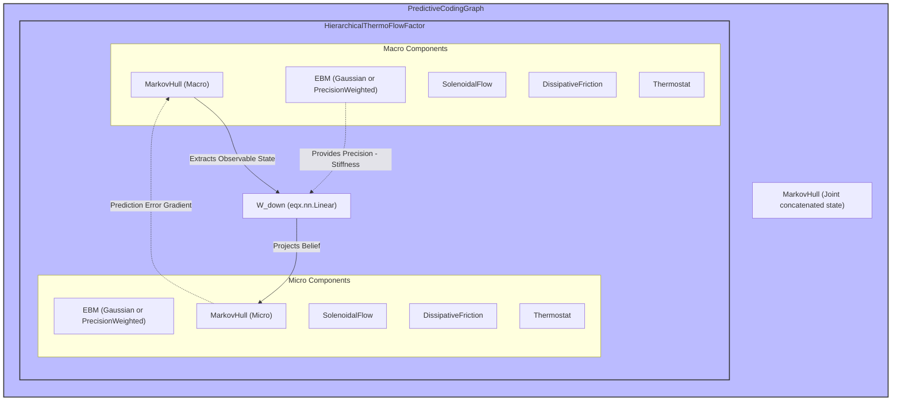

# Echo Architecture Diagram

This diagram visualizes the structure of the `PredictiveCodingGraph` and its internal components, highlighting the top-down hierarchical flow.

### Explanation of the PredictiveCodingGraph

1. **HierarchicalThermoFlowFactor**: This is the core physics engine of the graph. It houses all of the primitive physics objects for both the micro and macro levels.
2. **Structural Coupling (`W_down`)**: The linear projection matrix that maps the macro state's predictions down into the micro level's latent space, allowing the two otherwise independent systems to interact via prediction errors.
3. **Top-Down Hierarchy**: The macro observer sits at the top of the hierarchy, generating beliefs that flow downward via `W_down` to constrain the micro observer, which forms the physical sensorimotor boundary of the agent.
